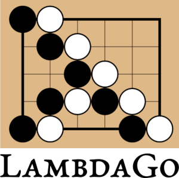

[](https://github.com/egri-nagy/lambdago/actions/workflows/clojure.yml)



LambdaGo is a software package bundling several functionalities for the ancient [game of go](https://en.wikipedia.org/wiki/Go_(game)).
Currently, it contains

  1. supporting tools (rating calculations, tournament scheduling) for the [Igo Math](https://egri-nagy.github.io/igomath/) course;
  2. reference implementation of a Go engine for the [Poetry of Programming](https://egri-nagy.github.io/popbook/) course;
  3. post-processing and visualization tools for AI analysis described in the paper [Derived metrics for the game of Go - intrinsic network strength assessment and cheat-detection](https://ieeexplore.ieee.org/document/9394360) (preprint [here](https://arxiv.org/abs/2009.01606)).

## Requirements
 * [Java runtime](https://www.java.com/) is needed to use LambdaGo, as it is written in [Clojure](https://www.clojure.org). This is the minimum requirement.
 * Leiningen is the build tool used in this project.
 * Lizzie's auto-analysis output can be visualized by LambdaGo.

## Running the LambdaGo system
The `jar` file can be downloaded from the release page, or when Leiningen is available it can be generated by `lein uberjar`.

```java -jar lambdago-YYYY.MM.DD-standalone.jar <command> <arguments>```

## Commands

### The GTP mode

